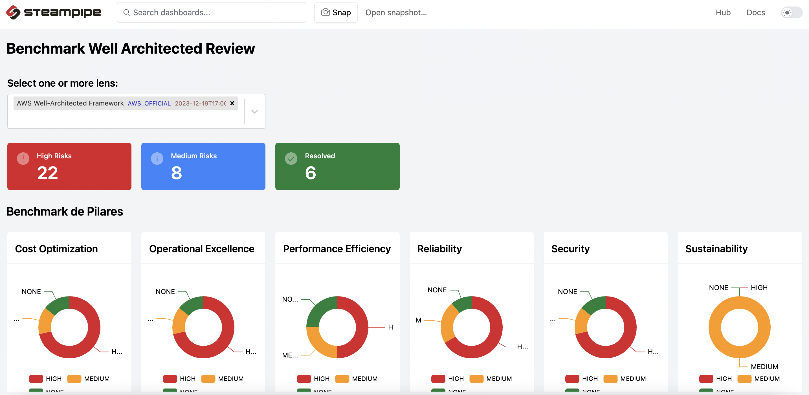

# steampipe-mod-aws-wa-insights


## Getting started

### Installation

Download and install Steampipe (https://steampipe.io/downloads). Or use Brew:

```sh
brew tap turbot/tap
brew install steampipe
```

Install the AWS plugin with [Steampipe](https://steampipe.io):

```sh
steampipe plugin install aws
```

Clone:

```sh
git clone https://github.com/turbot/steampipe-mod-aws-wa-insights.git
cd steampipe-mod-aws-wa-insights
```

Install mod dependencies:

```sh
steampipe mod install
```

### Usage

Before running any benchmarks, it's recommended to generate your AWS credential report:

```sh
aws iam generate-credential-report
```

Start your dashboard server to get started:

```sh
steampipe dashboard
```

By default, the dashboard interface will then be launched in a new browser
window at http://localhost:9194.

### Credentials

This mod uses the credentials configured in the [Steampipe AWS plugin](https://hub.steampipe.io/plugins/turbot/aws).

### Configuration

No extra configuration is required.
